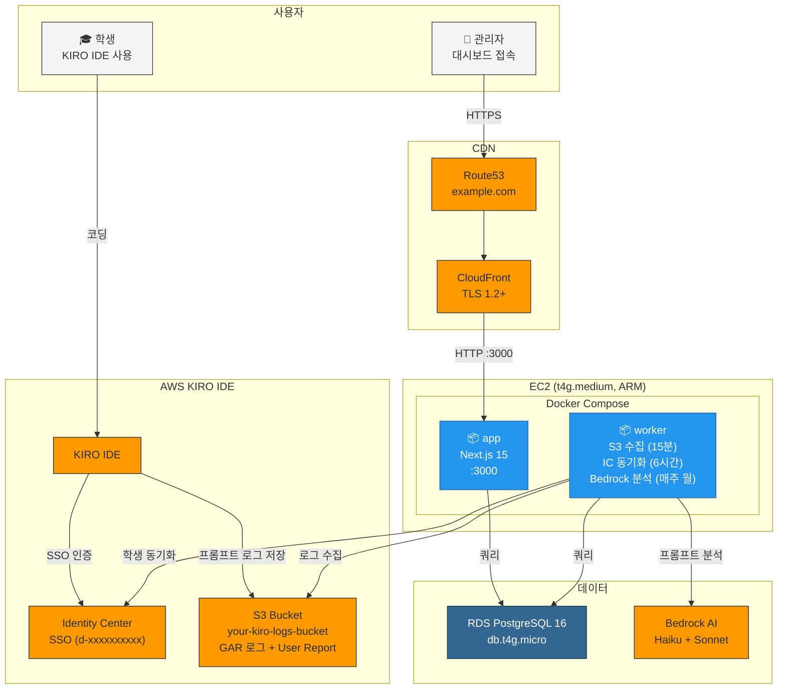
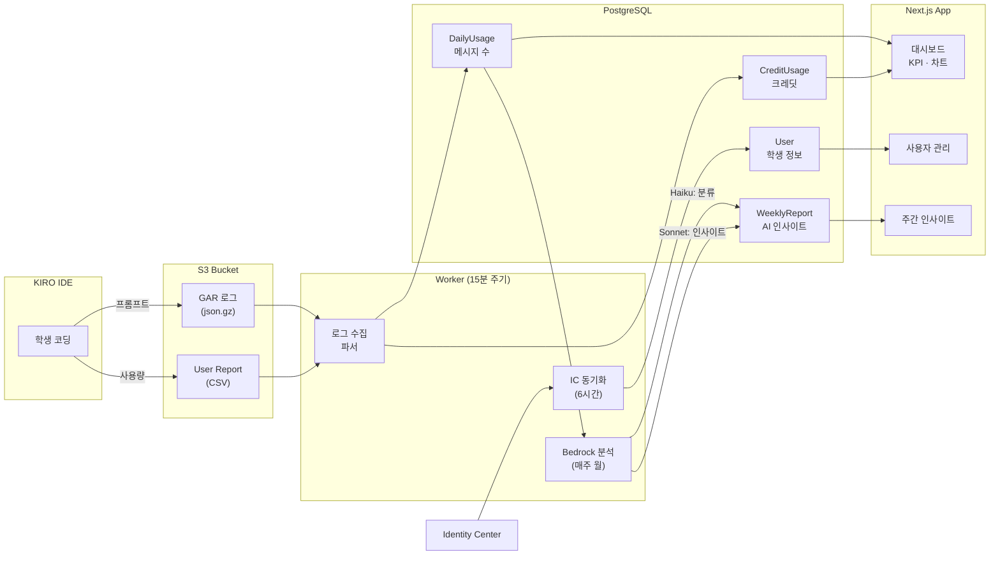

# NxtCloud KIRO Manager

> AWS **Kiro IDE**를 도입한 교육기관(대학·해커톤)의 구독·사용량·크레딧을 관리하는 오픈소스 운영 대시보드. NxtCloud가 실제 운영 중인 시스템을 공개합니다.

[](./LICENSE)
[](https://nextjs.org)
[](https://www.postgresql.org)

## 왜 만들었나

Kiro IDE를 강의·해커톤에서 운영하다 보면 다음 질문이 매주 반복됩니다.

- "지난주 학생들은 Kiro를 얼마나 썼고, 어떤 주제로 코딩했는가?"
- "수업별 활용률은 어떻게 차이나는가? 누가 손을 놓고 있는가?"
- "이번 학기 구독 시트가 남았는가? 다음 학기엔 몇 시트가 필요한가?"
- "AWS 청구서가 예산 안에 들어오는가?"

AWS가 제공하는 Identity Center + S3 GAR 로그 + User Report만으로는 답이 흩어져 있습니다. 이 프로젝트는 그 흩어진 신호를 **하나의 운영 대시보드**로 묶어, 교수·조교·영업·관리자 모두가 같은 화면을 보면서 의사결정하도록 합니다.

## 주요 화면 한눈에

- **메인 대시보드**: KPI 카운트업, 인사이트 텍스트, 수업별 비교, 일별/시간대별 사용 패턴
- **주간 AI 인사이트**: Bedrock(Haiku + Sonnet)이 프롬프트를 분석해 프로젝트 아이디어 동향·교육 필요 영역·기술 키워드를 자동 추출
- **사용자 관리**: 실명·소속·학번·수강과목 통합 뷰, 개인 상세 페이지
- **그룹/팀 분석**: 수업별 활용률 원형 게이지, 팀별 멤버 활동량
- **조직/구독**: 조직 + 구독 + AWS 계정 통합 관리
- **관리자 패널**: IAM 스타일 정책 엔진 (Deny 우선, 와일드카드, 시뮬레이션 API)

## Architecture



### Data Flow



## Tech Stack

| 영역 | 기술 |
|------|------|
| Frontend | Next.js 15 (App Router) + TypeScript + Tailwind CSS + shadcn/ui |
| Backend | Next.js API Routes |
| DB | PostgreSQL 16 via Prisma 7 ORM |
| Auth | JWT (jose) + bcryptjs, 역할 기반 접근 제어 |
| Charts | Recharts + Magic UI (Number Ticker, Circular Progress) |
| Worker | 별도 Docker 컨테이너 (S3 로그 수집, Bedrock AI 분석, node-cron) |
| Infra | Terraform (5개 모듈), EC2 + Docker Compose, CloudFront + RDS |
| CI/CD | GitHub Actions (태그 v* → SSH 배포) |
| Test | Playwright E2E (17개) |

## Features

- **대시보드**: KPI 카드 (카운트업), 인사이트 텍스트, 수업별 비교, 일별/시간대별 사용 패턴
- **주간 AI 인사이트**: Bedrock AI가 프롬프트를 분석하여 프로젝트 아이디어 동향, 교육 필요 영역, 기술 키워드 추출
- **사용자 관리**: 검색/필터/페이지네이션, 실명+소속+학번+수강과목 표시, 개인 상세 페이지
- **그룹/팀 분석**: 수업별 활용률 (원형 게이지), 그룹별 인사이트, 팀별 멤버 활동량
- **조직/구독 관리**: 조직+구독 통합 관리, AWS 계정 연동
- **관리자 패널**: 그룹/코스 CRUD, 계정·권한 관리 (IAM 스타일 정책)
- **IAM 정책 엔진**: Deny 우선 평가, 와일드카드 매칭, 정책 시뮬레이션 API
- **S3 배치 워커**: GAR 로그 + User Report 15분마다 자동 수집, Identity Center 동기화
- **과도기 스키마**: 레거시(수업별 그룹) + 미래(학교별 1그룹, 수업 매핑) 공존

## Identity Center 연동

KIRO는 AWS Identity Center SSO와 연동됩니다:
- `UserType`: "student" (학생) / null (관리자/강사)
- `Title`: `학교코드_학번` (예: `a-univ_20243133`)
- 서버에서 `schoolCode` + `studentId`로 개인 식별
- `CourseEnrollment`로 학생 ↔ 수업 ↔ 팀 매핑

## Quick Start

```bash
# 1. PostgreSQL 시작
docker-compose up db -d

# 2. 환경변수 설정
cp .env.example .env.local
# .env.local에서 AWS_ACCOUNT_ID, IDENTITY_STORE_ID 등 설정

# 3. DB 마이그레이션 + 시드
pnpm install
pnpm db:generate
pnpm db:push
pnpm db:seed

# 4. 개발 서버 시작
pnpm dev          # http://localhost:3000

# 5. (선택) S3 데이터 수집
pnpm worker                              # 실시간 수집 (15분 주기)
pnpm backfill --from 2026-03-01          # 과거 데이터 백필

# 6. (선택) 학생 명단 로드
pnpm tsx worker/load-roster.ts data/rosters/kiro-a-univ-cs-students.json
pnpm tsx worker/load-roster.ts data/rosters/kiro-b-univ-hackathon-students.json

# 7. (선택) 주간 프롬프트 분석 수동 실행
pnpm tsx worker/run-analysis.ts --week 2026-03-24
```

초기 로그인 계정은 아래 [시드 계정](#시드-계정) 섹션 참조.

## Commands

```bash
pnpm dev              # 개발 서버 (localhost:3000)
pnpm build            # 프로덕션 빌드
pnpm test             # Vitest 단위 테스트
pnpm e2e              # Playwright E2E 테스트
pnpm lint             # ESLint
pnpm db:generate      # Prisma client 생성
pnpm db:push          # DB 스키마 동기화
pnpm db:seed          # 시드 데이터
pnpm db:studio        # Prisma Studio (DB GUI)
pnpm worker           # S3 배치 워커 (실시간)
pnpm backfill         # 과거 데이터 백필
```

## Project Structure

```
src/
├── app/                    # Next.js App Router
│   ├── (auth)/login/       # 로그인 페이지
│   ├── (dashboard)/        # 대시보드 (16개 페이지)
│   │   ├── dashboard/      # 메인 대시보드 + KPI + 인사이트
│   │   ├── weekly-insight/  # 주간 AI 인사이트
│   │   ├── users/          # 사용자 목록 + [userId] 상세
│   │   ├── groups/         # 그룹별 활용률
│   │   ├── teams/          # 팀별 분석
│   │   ├── organizations/  # 조직+구독 관리
│   │   ├── admin/          # 관리자 (그룹/코스/계정·권한 — 편집/IAM 정책)
│   │   └── collection/     # 수집 상태 (관리자)
│   └── api/                # REST API (37개 엔드포인트)
├── lib/                    # prisma, auth, s3, date, validations, policy
├── services/               # 비즈니스 로직 (11개 서비스)
├── components/             # UI (shadcn/ui + layout + charts + dashboard)
└── hooks/                  # SWR 기반 데이터 페칭
worker/
├── collectors/             # GAR, Report, Identity Center 수집
├── analyzers/              # Bedrock 프롬프트 분석
├── parsers/                # json.gz, CSV 파서
├── backfill.ts             # 과거 데이터 백필 스크립트
├── run-analysis.ts         # 주간 분석 수동 실행
└── load-roster.ts          # 학생 명단 JSON → DB 로드
infra/
├── modules/
│   ├── vpc/                # VPC, 서브넷, IGW
│   ├── rds/                # PostgreSQL 16, 보안 그룹
│   ├── ec2/                # t4g.medium, Docker Compose, user_data
│   ├── iam/                # EC2 Role (S3, IC, Bedrock, CloudFront)
│   └── cdn/                # CloudFront, Route53, ACM
├── main.tf                 # 모듈 조합
└── terraform.tfvars        # 환경별 변수
e2e/                        # Playwright E2E 테스트 (17개)
```

## Deployment

### 프로덕션 환경

- **URL**: https://kiro-manager.example.com
- **EC2**: t4g.medium (Graviton ARM), us-east-1
  - **Swap 4GB** (`/swapfile`, `vm.swappiness=10`) — Next.js Turbopack 빌드 메모리 압박 해소
- **RDS**: PostgreSQL 16, db.t4g.micro, 20GB
- **CDN**: CloudFront → EC2 origin
- **DNS**: Route53 → CloudFront (ACM SSL)

### 배포 방법

GitHub에서 태그를 푸시하면 자동 배포:

```bash
git tag v1.1.0
git push origin v1.1.0
```

GitHub Actions가 SSH로 EC2에 접속 → `git pull` → 미사용 이미지/빌드 캐시 전체 정리 (`docker builder prune -af`) → `docker compose build` → `up -d` → `prisma db push` (스키마 동기화) → health check → CloudFront 캐시 무효화. job timeout 30분 (ARM 빌드 ~12분).

### Terraform (신규 환경)

```bash
cd infra
cp terraform.tfvars.example terraform.tfvars  # 환경별 변수 설정
terraform init
terraform plan
terraform apply
```

## AWS 인증

- **로컬**: `~/.aws/credentials` 또는 `AWS_ACCESS_KEY_ID`/`AWS_SECRET_ACCESS_KEY` 환경변수
- **서버(EC2)**: IAM Instance Profile (자동)
- AWS SDK v3 credential chain이 자동 탐색

## Bedrock AI 분석

매주 월요일 10:00 KST 자동 실행 (Worker cron):
- S3 프롬프트를 20% 샘플링 (첫 300자)
- Haiku: 카테고리 분류 + 기술 키워드 추출
- Sonnet: 프로젝트 아이디어 동향 + 교육 필요 영역 + 인사이트 생성
- 월 비용 ~$0.80

수동 실행: `pnpm tsx worker/run-analysis.ts --week 2026-03-24`

## 시드 계정

`pnpm db:seed` 실행 후 로컬 개발용으로 다음 계정을 사용할 수 있습니다.

| 계정 | 비밀번호 | 역할 |
|------|----------|------|
| `admin@example.com` | `admin1234` | ADMIN (전체 권한) |
| `a-univ-admin@example.com` | `a-univ1234` | SCHOOL (A 대학교 그룹만) |

샘플 조직은 `A 대학교`, `B 대학교`로 익명화되어 있습니다. 실제 운영 시 `prisma/seed.ts`를 본인 환경에 맞게 수정하세요.

## 기여 & 라이선스

- **License**: [MIT](./LICENSE)
- **Issues & PRs**: 환영합니다. Kiro 운영 경험을 공유해주세요.
- **연락**: NxtCloud — 교육 기관 Kiro 도입 문의는 [홈페이지](https://nxtcloud.kr)로.

---

**Built with ❤️ by NxtCloud for the AWS Kiro community.**
